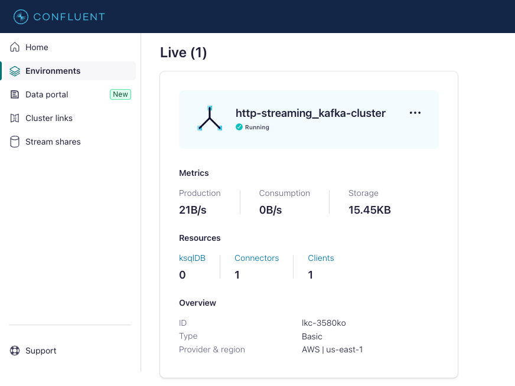
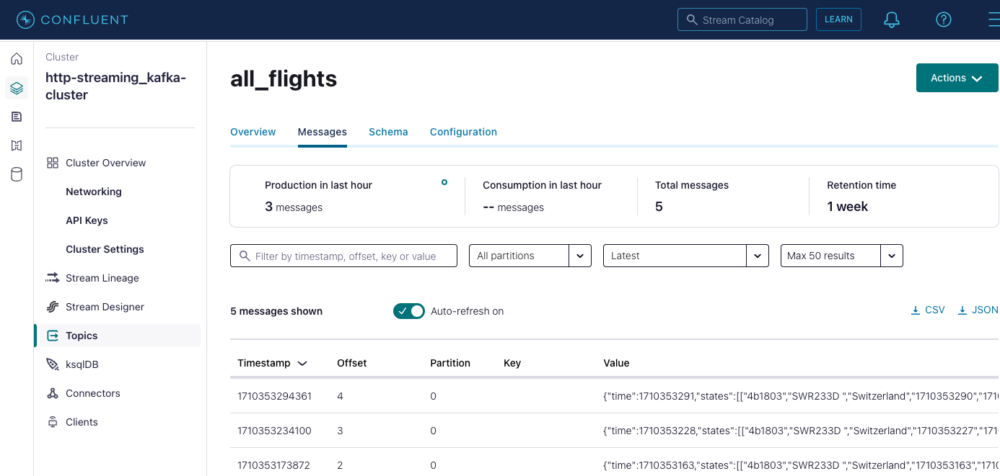
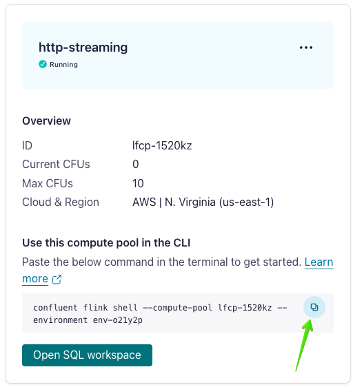
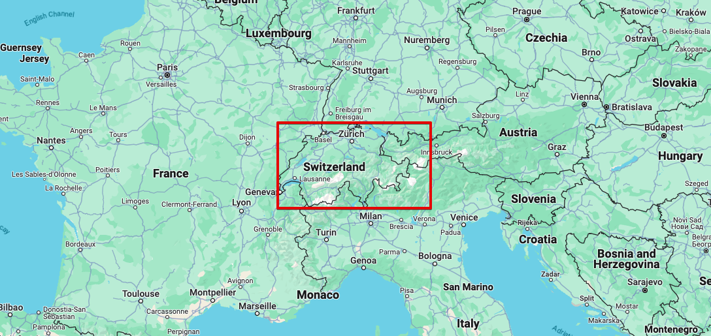

# OpenSky HTTP Streaming Relay Demo

This repository is a reproducible Confluent Cloud demo that polls the OpenSky REST API and publishes snapshots into Kafka.

It is a practical replacement for the original `demo-scene/http-streaming` connector-based flow. Instead of relying on a managed HTTP Source connector, this version uses a local relay that is easier to reproduce and debug.

## Quickstart

If you already have:

- a Confluent Cloud environment
- a Kafka cluster
- a Flink compute pool
- Kafka API credentials
- Schema Registry API credentials

then the shortest path is:

1. Create the topic:

```bash
confluent kafka topic create all_flights \
  --cluster <KAFKA_CLUSTER_ID> \
  --environment <ENVIRONMENT_ID>
```

2. Copy the env template:

```bash
cp .env.example .env
```

3. Fill in `.env`.

4. Start the relay:

```bash
python3 relay_opensky.py
```

5. Validate the topic:

```bash
confluent kafka topic consume all_flights \
  --bootstrap <BOOTSTRAP_SERVERS> \
  --api-key <KAFKA_API_KEY> \
  --api-secret <KAFKA_API_SECRET> \
  --value-format jsonschema \
  --schema-registry-endpoint <SCHEMA_REGISTRY_URL> \
  --schema-registry-api-key <SCHEMA_REGISTRY_API_KEY> \
  --schema-registry-api-secret <SCHEMA_REGISTRY_API_SECRET> \
  --from-beginning
```

6. Run the Flink walkthrough from:

```text
sql/flink_demo.sql
```

If you need the full setup flow, including service account and API key creation, continue below.

## What You Get

- OpenSky polling every 60 seconds
- Kafka topic: `all_flights`
- Schema-managed payloads via JSON Schema
- Flink SQL walkthrough for exploring and cleansing the data

## Repository Contents

- `relay_opensky.py`: local OpenSky-to-Kafka relay
- `opensky_poll.schema.json`: topic value schema
- `.env.example`: runtime config template
- `sql/flink_demo.sql`: Flink SQL walkthrough
- `img/`: screenshots adapted from the original demo

## Prerequisites

- Python 3
- Confluent CLI installed and authenticated
- A Confluent Cloud environment
- A Kafka cluster
- A Flink compute pool
- Kafka API credentials for the cluster
- Schema Registry API credentials with subject registration access

## Recommended Resource Names

Use these names to match the demo:

- Kafka cluster: `http-streaming_kafka-cluster`
- Flink compute pool: `http-streaming`
- Kafka topic: `all_flights`

## 1. Create The Topic

```bash
confluent kafka topic create all_flights \
  --cluster <KAFKA_CLUSTER_ID> \
  --environment <ENVIRONMENT_ID>
```

## 2. Create Demo Credentials

If you already have a Kafka API key and Schema Registry API key you want to use, skip to the next section.

Otherwise, this is a clean setup pattern:

1. Create a service account:

```bash
confluent iam service-account create http-streaming-relay \
  --description "Service account for OpenSky relay" \
  -o json
```

2. Grant it Kafka access on the demo cluster:

```bash
confluent iam rbac role-binding create \
  --principal User:<SERVICE_ACCOUNT_ID> \
  --role CloudClusterAdmin \
  --environment <ENVIRONMENT_ID> \
  --cloud-cluster <KAFKA_CLUSTER_ID>
```

3. Grant it Schema Registry subject access:

```bash
confluent iam rbac role-binding create \
  --principal User:<SERVICE_ACCOUNT_ID> \
  --role ResourceOwner \
  --environment <ENVIRONMENT_ID> \
  --schema-registry-cluster <SCHEMA_REGISTRY_CLUSTER_ID> \
  --resource "Subject:*"
```

4. Create a Kafka API key:

```bash
confluent api-key create \
  --resource <KAFKA_CLUSTER_ID> \
  --service-account <SERVICE_ACCOUNT_ID> \
  --environment <ENVIRONMENT_ID> \
  -o json
```

5. Create a Schema Registry API key:

```bash
confluent api-key create \
  --resource <SCHEMA_REGISTRY_CLUSTER_ID> \
  --service-account <SERVICE_ACCOUNT_ID> \
  --environment <ENVIRONMENT_ID> \
  -o json
```

If you want a shell-friendly setup flow, export the IDs first:

```bash
export ENVIRONMENT_ID=env-xxxxxx
export KAFKA_CLUSTER_ID=lkc-xxxxxx
export SCHEMA_REGISTRY_CLUSTER_ID=lsrc-xxxxxx
```

Then create everything:

```bash
SA_JSON=$(confluent iam service-account create http-streaming-relay \
  --description "Service account for OpenSky relay" \
  -o json)
export SERVICE_ACCOUNT_ID=$(echo "$SA_JSON" | jq -r '.id')

confluent iam rbac role-binding create \
  --principal User:$SERVICE_ACCOUNT_ID \
  --role CloudClusterAdmin \
  --environment $ENVIRONMENT_ID \
  --cloud-cluster $KAFKA_CLUSTER_ID

confluent iam rbac role-binding create \
  --principal User:$SERVICE_ACCOUNT_ID \
  --role ResourceOwner \
  --environment $ENVIRONMENT_ID \
  --schema-registry-cluster $SCHEMA_REGISTRY_CLUSTER_ID \
  --resource "Subject:*"

KAFKA_KEY_JSON=$(confluent api-key create \
  --resource $KAFKA_CLUSTER_ID \
  --service-account $SERVICE_ACCOUNT_ID \
  --environment $ENVIRONMENT_ID \
  -o json)

SR_KEY_JSON=$(confluent api-key create \
  --resource $SCHEMA_REGISTRY_CLUSTER_ID \
  --service-account $SERVICE_ACCOUNT_ID \
  --environment $ENVIRONMENT_ID \
  -o json)
```

Extract the credentials:

```bash
export KAFKA_API_KEY=$(echo "$KAFKA_KEY_JSON" | jq -r '.api_key')
export KAFKA_API_SECRET=$(echo "$KAFKA_KEY_JSON" | jq -r '.api_secret')
export SCHEMA_REGISTRY_API_KEY=$(echo "$SR_KEY_JSON" | jq -r '.api_key')
export SCHEMA_REGISTRY_API_SECRET=$(echo "$SR_KEY_JSON" | jq -r '.api_secret')
```

## 3. Configure The Relay

Copy the env template:

```bash
cp .env.example .env
```

Fill in these values in `.env`:

- `BOOTSTRAP_SERVERS`
- `KAFKA_API_KEY`
- `KAFKA_API_SECRET`
- `SCHEMA_REGISTRY_URL`
- `SCHEMA_REGISTRY_API_KEY`
- `SCHEMA_REGISTRY_API_SECRET`
- `TOPIC=all_flights`
- `POLL_INTERVAL_SECONDS=60`

Expected `BOOTSTRAP_SERVERS` format:

```text
SASL_SSL://pkc-xxxx.us-east-1.aws.confluent.cloud:9092
```

## 4. Start The Relay

```bash
python3 relay_opensky.py
```

Expected output:

```text
Polling OpenSky every 60s and producing to all_flights
Successfully registered schema with ID "100043".
snapshot_time=1774975712 states=88
```

If you keep the process running, it will publish one OpenSky snapshot every minute.

## 5. Verify Kafka Data

Consume from the topic:

```bash
confluent kafka topic consume all_flights \
  --bootstrap <BOOTSTRAP_SERVERS> \
  --api-key <KAFKA_API_KEY> \
  --api-secret <KAFKA_API_SECRET> \
  --value-format jsonschema \
  --schema-registry-endpoint <SCHEMA_REGISTRY_URL> \
  --schema-registry-api-key <SCHEMA_REGISTRY_API_KEY> \
  --schema-registry-api-secret <SCHEMA_REGISTRY_API_SECRET> \
  --from-beginning
```

You should see records shaped like:

```json
{
  "time": 1774975712,
  "states": [
    {
      "icao24": "39de4b",
      "callsign": "TVF3589",
      "origin_country": "France",
      "time_position": 1774975711,
      "last_contact": 1774975711,
      "longitude": 9.1141,
      "latitude": 45.907,
      "baro_altitude": 11582.4,
      "on_ground": false,
      "velocity": 238.72,
      "true_track": 283.08,
      "vertical_rate": -0.33,
      "sensors": null,
      "geo_altitude": 11529.06,
      "squawk": "3716",
      "spi": false,
      "position_source": 0
    }
  ]
}
```

Reference screens from the original demo:





## 6. Explore In Flink

Once the relay is publishing, `all_flights` becomes available to Flink.

Start with:

```sql
SHOW TABLES;
DESCRIBE all_flights;
SELECT * FROM all_flights;
```

Or run the full walkthrough from:

```text
sql/flink_demo.sql
```

Flink reference screen:



## 7. Shape And Cleanse The Data

The raw topic contains one record per poll, with many aircraft in the `states` array.

The Flink SQL walkthrough:

- unnests `states`
- creates one row per aircraft
- types the fields
- trims padded string values
- materializes a cleaner table called `all_flights_cleansed`

Bounding box used in the demo:



## Why This Version Is Easier To Reproduce

The original upstream demo depended on a managed HTTP Source connector path that is not consistently reliable now:

- the old connector config is stale
- the V2 connector may still fail if the managed runtime cannot reach `opensky-network.org`

This repo avoids that by moving the polling step local while keeping the rest of the demo flow intact.

## Tear Down

1. Stop the relay with `Ctrl-C`.
2. Delete demo-only cloud resources:
   - `all_flights`
   - `http-streaming_kafka-cluster`
   - `http-streaming`
3. Delete any temporary Kafka or Schema Registry API keys you created for the demo.

## Attribution

This repository adapts the original Confluent `demo-scene/http-streaming` demo under Apache 2.0 terms.

See `ATTRIBUTION.md` and `LICENSE`.
